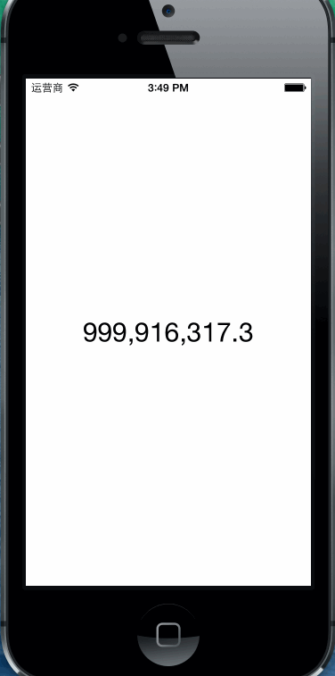

YXYNumberAnimationLabel [](https://travis-ci.org/yulingtianxia/YXYNumberAnimationLabel)  
=======================


一个数字动画Label  



##使用方法

设置AnimationSpeed属性的值可以调节动画变化速度，getter/setter方法如下：  

``` 
-(double)AnimationSpeed;
-(void)setAnimationSpeed:(double)speed;
``` 

字体会根据数字位数来自动调节字体大小，你也可以通过实现numberSizeBlock来自定义字体大小，例如：

``` 
[self.numberLabel setNumberSizeBlock:^(double number) {
        self.numberLabel.font = [UIFont fontWithName:self.numberLabel.font.fontName size:30.0];
}];
``` 

最后调用`changeFromNumber: toNumber: withAnimationTime:`方法来让数字动起来：  

``` 
[self.numberLabel changeFromNumber:1 toNumber:999999999 withAnimationTime:0.001];
``` 

##安装

###CocoaPods Installation
在Podfile中加入：  

``` 
pod 'YXYNumberAnimationLabel'
``` 

###Manual Installation

将YXYNumberAnimationLabel文件夹拖拽到你的工程